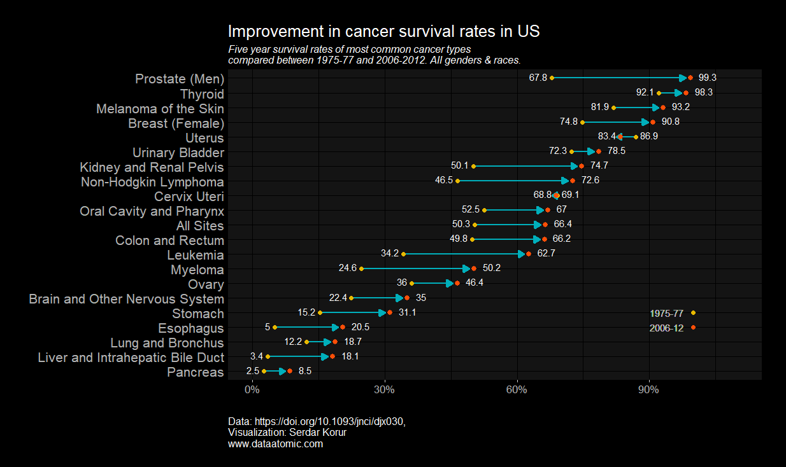
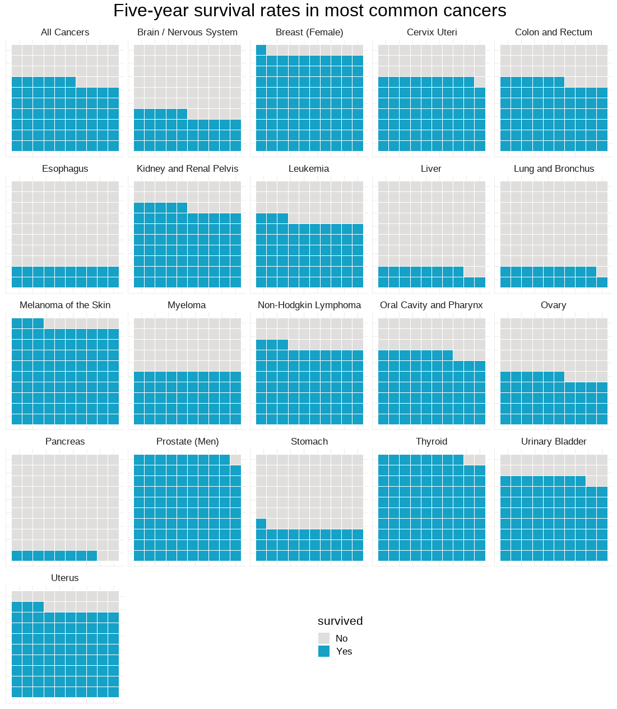
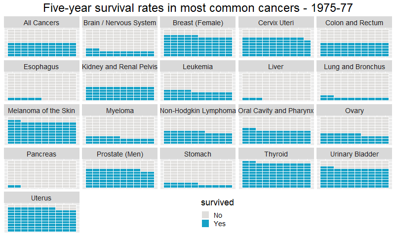
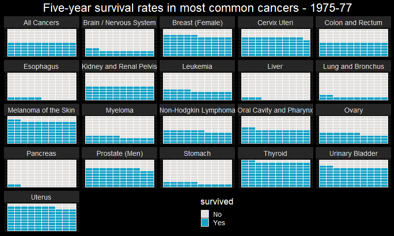

## Different visualizations of cancer statistics 

I visualized the changes in cancer survival rates between 1975-77 to 2006-2012.

**Data**: Original publication and the excel file [here](data)

**Code**: click [here](code/cancer_survival_stats.Rmd)

**Note**: Link to my blog with similar posts with detailed annotations [here](https://www.dataatomic.com)

## Lolipop plot

  

## Waffle plot

  

## Animated

White background

  

Black background

  

Data source:

Jemal, A. et a. (2017). Annual Report to the Nation on the Status of Cancer, 1975–2014, Featuring Survival, JNCI: Journal of the National Cancer Institute, Volume 109, Issue 9, 1 September 2017.

