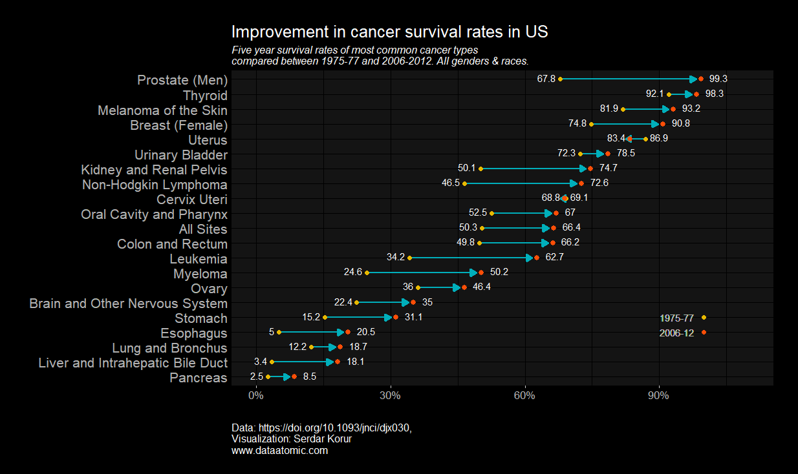

I visualized the improvement rates in the cancer survival between years 1975-77 to 2006-2012.

Data source:

Jemal, A. et a. (2017). Annual Report to the Nation on the Status of Cancer, 1975–2014, Featuring Survival, JNCI: Journal of the National Cancer Institute, Volume 109, Issue 9, 1 September 2017.

